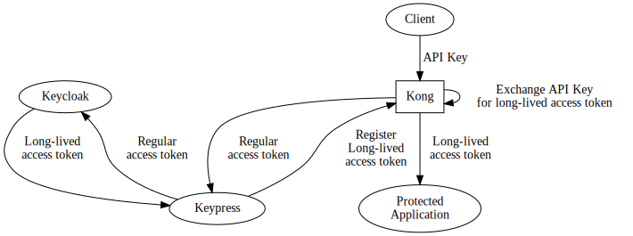

# Design

This application has 2 components

+ The service that manages the API key and a light frontend
+ A kong plugin, and a database that is part of kong

## Service that manages API key

+ Users must log in to KeyCentre as they would with any other SSO-protected site
  + KeyCentre is an OAuth client on its own
+ KeyCentre will register itself as a valid redirect-uri of all the
  applications it is managing API keys of

### Getting a long-lived access token

+ KeyCentre will redirect the user to authenticate with Keycloak, using the regular authorization code flow
+ The browser will return an authorization code, Kong will swap that for the access token and pass the access token to KeyCentre
+ KeyCentre will exchange the access token for a long-lived access token through loorent's Keycloak plugin
+ KeyCentre will then issue a randomly generated API key, and set the access token at the kong plugin

> Need to check if kong-oidc will handle exchanging of authorization codes of
>   clients other than the main client, which is KeyCentre. If we're already
>   logged in to KeyCentre, will kong-oidc still swap the authorization code on
>   KeyCentre's behalf?

### Listing access tokens

+ KeyCentre should be able to list access tokens, grouped by application that it is protecting

### Revoking access tokens

+ KeyCentre will call the revoke access token endpoint of the Kong plugin, and remove the API key from its own database

## Kong plugin

### Set access tokens

This is an API endpoint that will receive an (API key, access token) pair, and write it to a table in the Kong database

### Revoke access tokens

This is an API endpoint that will receive an API key remove it from the table in the Kong database

### Proxy

This will read the API Key from the `X-API-KEY` header, and look it up in the Kong database.

If it exists, allow routing to continue using the matching long-lived access token.

If it does not exist, reject the user with a HTTP error code

> We don't need to check that the access token matches the requested path,
>   because the resource server will validate that it is the intended audience
>   of the access token
